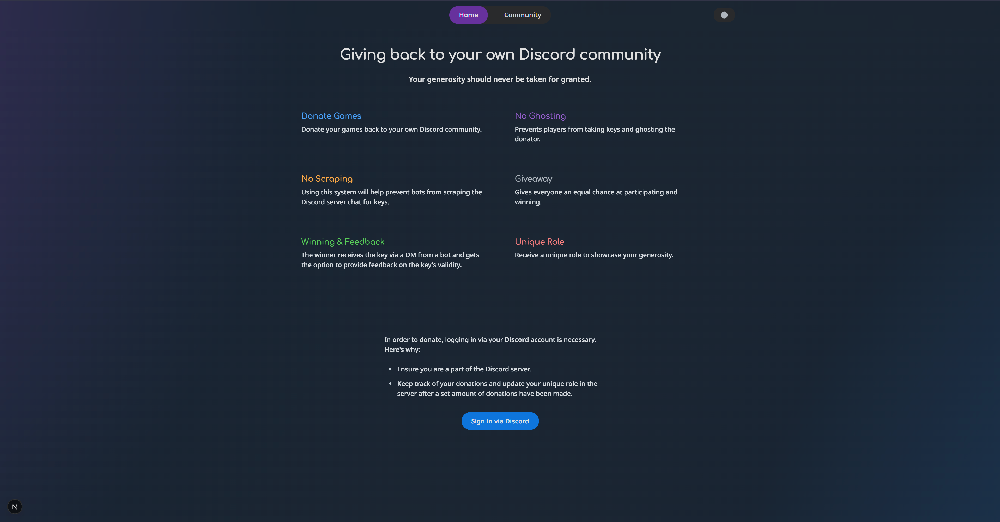
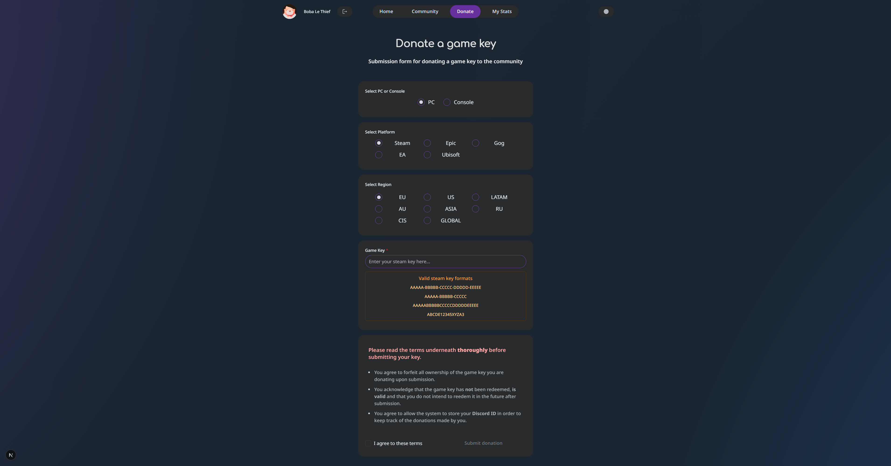

# What is Ludonium?
Ludonium is an application that takes in donated game keys from discord members of a server, and initiates a giveaway back to same discord server community.  

It prevents bot scraping and members of the community from also ghosting the user whom has given away the key.  
(**Showing of appreciation is always nice to see**)

## How does it work?
Once a user has donated a key, the key will be encrypted into the database and a giveaway will be initiated on the server.  
People in the community will be able to participate by reacting to the message.  
After a set amount of time has passed a winner will be selected and a DM will be sent to the winner by a bot with the key. 

### Showcase

### Is it done? 
No, I'm still actively working on this in my spare time as a passion project. 

#### Setting it up
I'll fill this in once the project is close to being fully functional.
